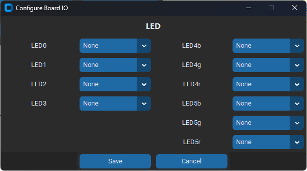
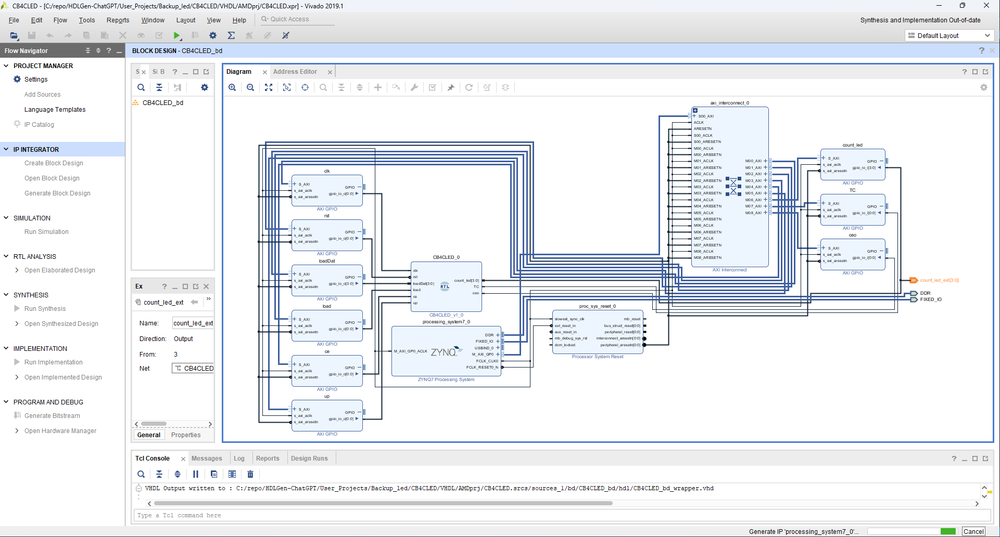
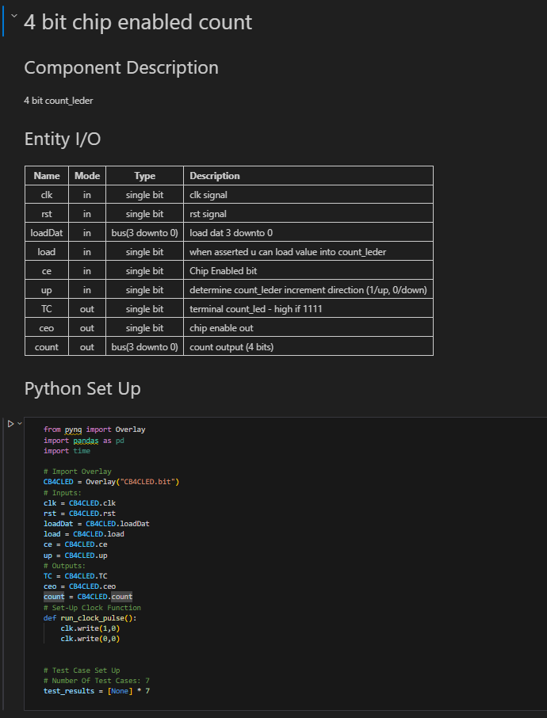
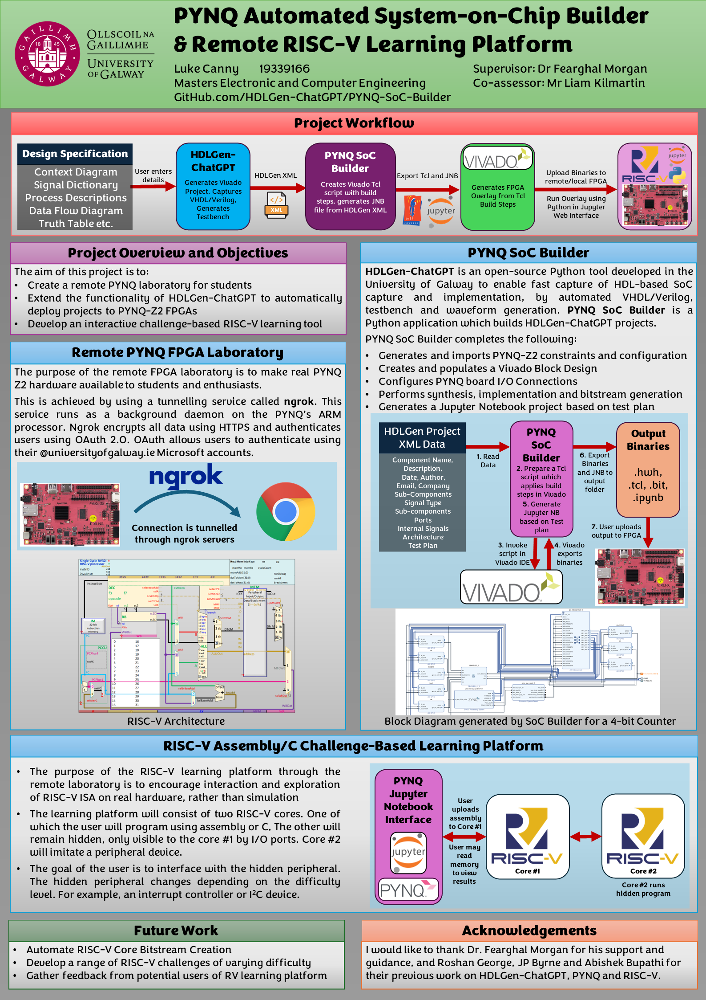

# PYNQ SoC Builder for HDLGen-ChatGPT

## Overview 

PYNQ SoC Builder is a standalone Python application which:

- Configures Vivado project for PYNQ-Z2
- Generates and imports PYNQ-Z2 board constraints
- Creates and populates Vivado Block Design
- Configures PYNQ board I/O connections
- Performs synthesis, implementation and bitstream generation
- Generates Jupyter Notebook project based on provided test plan

PYNQ SoC Builder is compatible with Vivado 2019.1 and 2023.2. Versions in between may work, but are untested.

## Installation

1. Clone this repo to any directory
2. Open Command Prompt and go to the cloned repo directory
3. Install the required libraries using ```pip install -r requirements.txt```
4. Install PYNQ-Z2 board in Vivado by unzipping _pynq-z2.zip_ at ```<Xilinx installation directory>/Vivado/<version>/data/boards/board_files```

## Run Application

```
python main.py
```

## How to Use

To open a HDLGen project use the browse option to find the project's .hdlgen file.


### Options

- **Open Vivado GUI**: Should the Vivado GUI be visable whilst build is executing. (Headless mode may improve performance)
- **Keep Vivado Open:** This flag keeps Vivado open after bitstream generation has completed, user must manually close Vivado to complete SoC Builder process.
- **Generate JNB:** This flag enables Jupyter Notebook generation.
- **Use Testplan:**  If not enabled, a generic .ipynb project is generated. If enabled, code to execute each individual testcase is generated as cells in JNB project.
- **Use Board I/O:** If disabled, no I/O connections to PYNQ ports are made. If enabled, configuration defined in configuration pop-up menu is applied (select Configure I/O button to set)

**_Please note_** more I/O ports available on PYNQ are to be added shortly 





From the Configure Board I/O menu, any HDLGen port may be connected to PYNQ ports.

Once configured, the program may be run. Once the build has been completed, all output files are available at ```<SoC-Builder-Directory>\output\```


Once the build has completed and you are ready to use PYNQ Z2 remote lab, select the "Remote Lab" option on the Main Menu. You will have an opportunity to select online boards or a livestream of the boards (for viewing LED I/O output).


Selecting an option will open the corresponding board's Jupyter Notebook environment in your default web-browser.

## Results

### Block Design generated by SoC Builder on a CB4CLED project.



### Jupyter Notebook produced from testplan for CB4CLED




## Notes

- If a signal is to be used for I/O all bits of the chosen signal must be used - this is because once a signal has been made external, no floating pins are allowed.

## Project Poster

